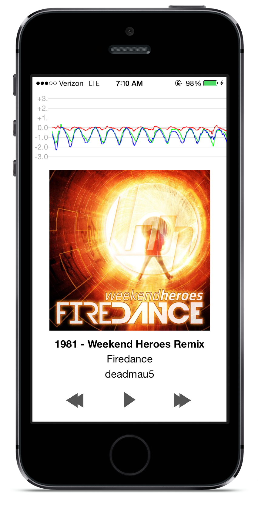

Tempofy
=======

Use data from your iPhone's accelerometer to queue up a song on Spotify that matches the rhythm of your jogging/dancing/underwater basket weaving.

To do
-----

- Demo mode with 30-second clips that doesn't require Spotify Premium
- BPM calculation and matching on device (currently requires backend server)

Resources
---------

- [A Method for Automatic Identification of Reliable Heart Rates Calculated from ECG and PPG Waveforms](http://www.ncbi.nlm.nih.gov/pmc/articles/PMC1513657/)
- [AccelerometerGraph](https://developer.apple.com/library/ios/samplecode/AccelerometerGraph/Introduction/Intro.html)
- [Simple Track Playback](https://github.com/spotify/ios-sdk/tree/master/Demo%20Projects/Simple%20Track%20Playback)
